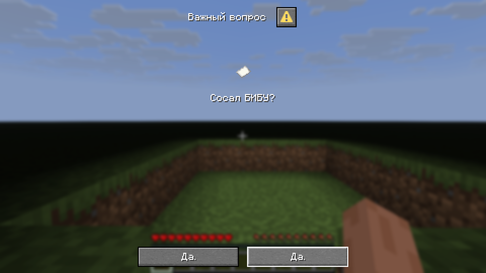

# Диалоги в Minestom

---
## Содержимое


- [Вступление](README.md#вступление)
- [Структура диалогов](docs/STRUCTURE.md#структура-диалогов)

***
## Вступление

---

[Диалог](https://minecraft.wiki/w/Dialog) — это простое модальное окно, 
которое может отображать информацию и принимать входные данные игрока, 
введённое в Minecraft *Java Edition* с версии
[1.21.6](https://minecraft.wiki/w/Java_Edition_1.21.6). 
Простым языком суть диалога это показать текст и что-то сделать после нажатия 
кнопочки.
В **Minestom** поддержка диалогов была введена с версии 
[Minestom 1.21.7 / 1.21.6](https://github.com/Minestom/Minestom/releases/tag/2025.07.10-1.21.7).

В Vanilla диалог отображается при помощи команды
[/dialog](https://minecraft.wiki/w/Commands/dialog) с подлежащими параметрами. 
Структура диалогового окна, в зависимости от типа, описывается при помощи 
**json**, который либо указывается как параметр команды, либо записывается в datapack по пути
`datapackName[.zip]\data\namespace\dialog\<name>.json`.

В Minestom диалоги строются при помощи records. Если никогда про них не слышал быстро [тык](https://docs.oracle.com/en/java/javase/17/language/records.html).
Быстрый пример как это работает:

```java
//Создаётся сам диалог
var dialog = new Dialog.Confirmation(
        new DialogMetadata(
                Component.text("Важный вопрос"), //title
                null, //externalTitle
                false, //canCloseWithEscape
                false, //pause
                DialogAfterAction.CLOSE, //afterAction
                List.of( //body
                        new DialogBody.Item( 
                                ItemStack.of(Material.PAPER), //itemStack
                                null, false, false, 16, 16), //description, showDecoration, showTooltip, width, height
                        new DialogBody.PlainMessage(Component.text("Сосал БИБУ?"), 100) //contents, width
                ), List.of() //inputs
        ),
        new DialogActionButton(Component.text("Да."), null, 100, null), //label, tooltip, width, action
        new DialogActionButton(Component.text("Да."), null, 100, null)  //. . . 
);
```
Показать игроку созданный диалог:
```java
player.showDialog(dialog);
```
Как это выглядит:

В целом реализация Minestom верно следует структуре ванильных диалогов, потому
при независимом ознакомлении рекомендуется сопоставлять официальную [wiki](https://minecraft.wiki/w/Dialog) и
документацию по [package:net.minestom.server.dialog](https://javadoc.minestom.net/net.minestom.server/net/minestom/server/dialog/package-summary.html)
***

`Дальше`: [Структура диалогов](docs/STRUCTURE.md#структура-диалогов)
