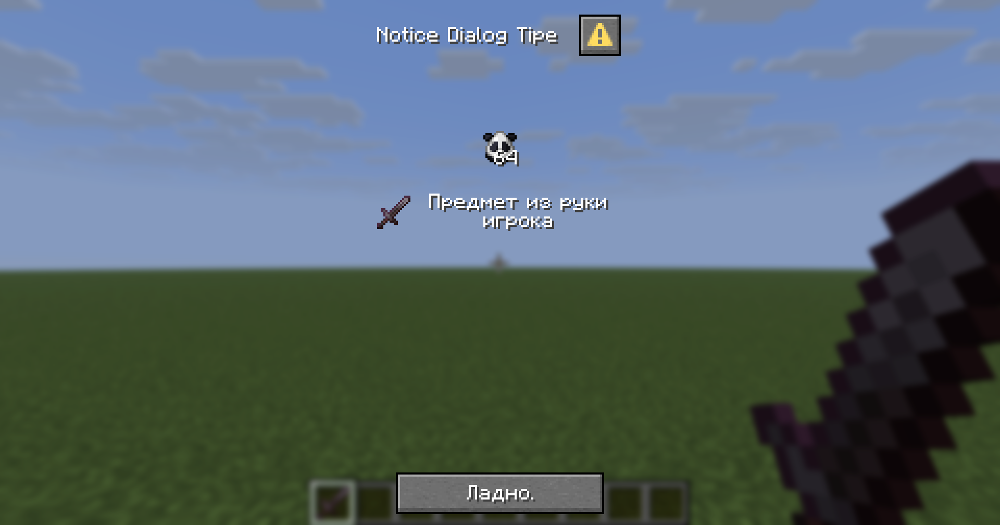
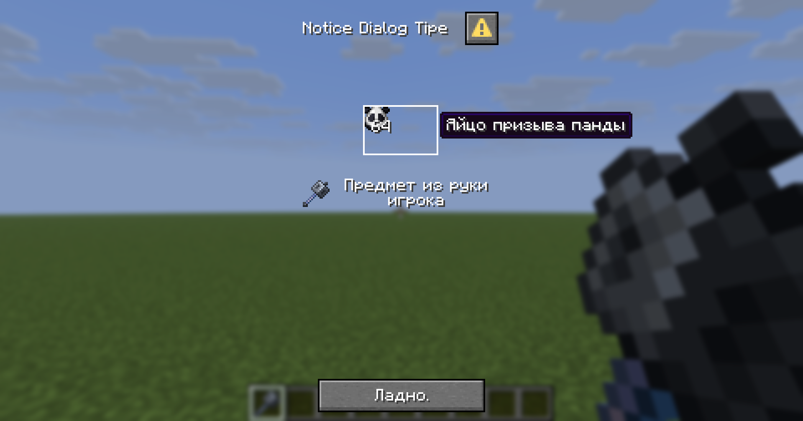
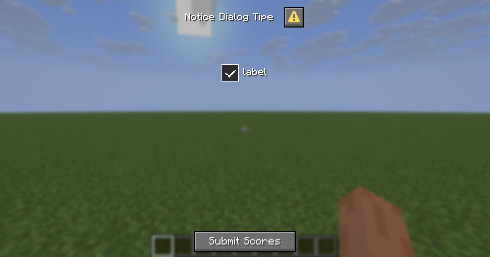
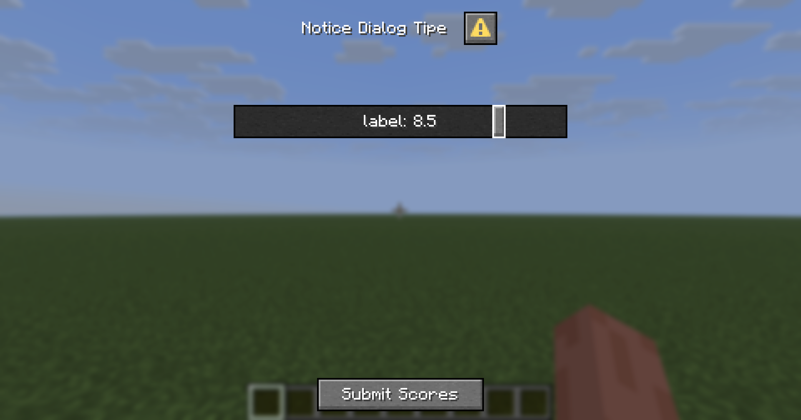
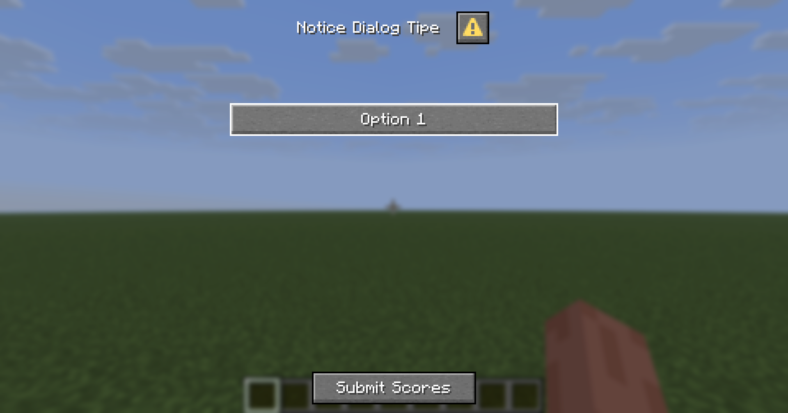
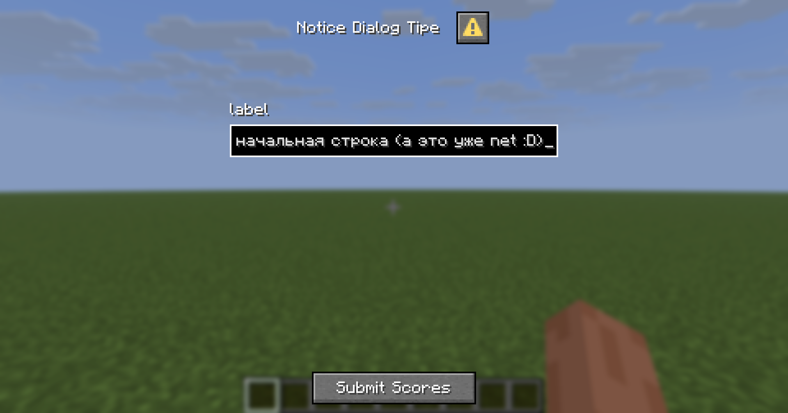

## DialogBody

`DialogBody` — интерфейс описывающий виджеты содержащиеся в контейнере `body` диалогового окна. На момент написания 
статьи имеет две конкретные релизации: `DialogBody.PlainMessage`, `DialogBody.Item`.

### DialogBody.PlainMessage

`PlainMessage` отображает текст в диалоговом окне. Имеет следующий конструктор:
```java
PlainMessage(Component contents, int width)
```
- `contents` текст. Создается методом `Component.text(String s)`
- `width` ширина рамки текста 

### DialogBody.Item
`Item` отображает внутриигровой предмет в диалоговом окне. Показывает не только текстуру предмета, но и, в зависимости 
от параметров, его количество, текстовую подсказку и эффект зачарования.

Конструктор *предмета*:

```java
Item(ItemStack itemStack, @Nullable DialogBody.PlainMessage description, boolean showDecoration, boolean showTooltip, int width, int height)
```
- `itemStack` *"Представляет собой неизменяемый предмет, который может быть помещен в инвентарь"* Проще всего создать
статическим методом `ItemStack.of(Material material, int amount)`. Или его перегрузками, которые описаны [тут](https://javadoc.minestom.net/net.minestom.server/net/minestom/server/item/ItemStack.html#of(net.minestom.server.item.Material)).
Можно передавать даже предметы из инвенторя игрока!
- `description` текстовый компонент, который отобразится справа от предмета
- `showDecoration` *в теории при `false` отключает отображение колличества предмета. На деле у автора статъи оно ничего 
не меняет*
- `showTooltip` показывается ли имя предмета при наведении на него курсором
- `width` ширина рамки предмета. Рекомендуется значение около `16` покрывающее размер текстуры
- `height` высота рамки предмета. Рекомендуется значение около `16` покрывающее размер текстуры

При больших значениях `width` и `height` текстура предмета остается привязана к верхнему левому углу *рамки*. Объекты
слева и снизу смещаются.

Для примеров будет использоваться тип диалога `Notice`. Подробнее про типы диалогов — [тут](STRUCTURE.md#типы-диалогов).

```java              
var noticeDialog = new Dialog.Notice(
        new DialogMetadata(
                Component.text("Notice Dialog Tipe"),
                null,
                true,
                false,
                DialogAfterAction.CLOSE,
                List.of(
                        new DialogBody.Item(
                                ItemStack.of(Material.PANDA_SPAWN_EGG, 64),
                                null,//new DialogBody.PlainMessage(Component.text("description"), 100),
                                false, true, 16, 16),
                        new DialogBody.Item(
                                player.getItemInMainHand(), //Если в руке игрока ничего нет, то его выкинет из игры!!!
                                new DialogBody.PlainMessage(
                                        Component.text("Предмет из руки игрока"), 100),
                                false, true, 16, 16)
                ),
                List.of()
        ),
        new DialogActionButton(Component.text("Ладно."), null, 100, null)
);
```

Как это выглядит:



Изменив `width` и `height` получится следующее: 
```java
new DialogBody.Item(
        ItemStack.of(Material.PANDA_SPAWN_EGG, 64),
null,//new DialogBody.PlainMessage(Component.text("description"), 100),         
false, true, 45, 30)
```


## DialogInput
`DialogInput` — интерфейс описывающий виджеты ввода содержащиеся в контейнере `inputs` диалогового окне. На 
момент написания статьи имеет следущие конкретные реализации:
- `DialogInput.Boolean`
- `DialogInput.NumberRange `
- `DialogInput.SingleOption`
- `DialogInput.Text`
- `DialogInput.Text.Multiline`

Для примера будет использоваться диалог типа `Notice`
```java
var notice = new Dialog.ServerLinks(
        new DialogMetadata(
                Component.text("Notice Dialog Tipe"),
                null,
                false,
                false,
                DialogAfterAction.CLOSE,
                List.of(),
                List.of(
                        new DialogInput.Boolean("alpha", Component.text("label"), true, "aboba", "biboba")
                )
        ),
        new DialogActionButton(
                Component.text("Подтвердить ввод"),
                Component.text("§7Нажми чтобы отправить серверу данные которые ты ввёл в этом окне"),
                100,
                new DialogAction.DynamicCustom(Key.key("omega"), CompoundBinaryTag.builder().build()) //Чеховское ружьё
        )
);
```
### Boolean
Виджет-галочка. Имеет следующий конструктор:

```java
    public Boolean(String key, Component label, boolean initial, String onTrue, String onFalse)
```
- `key` ключ по которому можно будет получить значение введённое в виджет
- `label` текстовый компонент, который отобразится справа от предмета. Создается методом `Component.text(String s)`
- `initial` первоначальное состояние виджета. Если `true`, то поставлена галочка
- `onTrue` предположительно необходим для `datapack`. Автор признаёт что `не понял их смысл`
- `onFalse` предположительно необходим для `datapack`. Автор признаёт что `не понял их смысл`

Готовый пример:
```java
var booleanInput = new DialogInput.Boolean("alpha", Component.text("label"), true, "aboba", "biboba");
```

Выглядит это так:



`BinaryTag`, который генерирует `DialogAction.DynamicCustom`:
```json
BinaryTagType[CompoundBinaryTag 10]{tags={"alpha"=BinaryTagType[ByteBinaryTag 1 (numeric)]{value=1}}}
```

Получить значение из виджета можно так:
```java
globalEventHandler.addListener(PlayerCustomClickEvent.class, (event) -> {
    if(event.getKey().equals(Key.key("omega"))) { //Чеховское ружьё
        boolean booleanValue = ((CompoundBinaryTag) event.getPayload()).getBoolean("alpha"); //`key`
    }
});
```
### NumberRange 

Виджет-ползунок. Имеет следующий конструктор:
```java
NumberRange(String key, int width, Component label, String labelFormat, float start, float end, @Nullable Float initial, @Nullable Float step)
```

- `key` ключ по которому можно будет получить значение введённое в виджет
- `width` ширина виджета
- `label` текстовый компонент, который отобразится внутори виджета. Создается методом `Component.text(String s)`
- `labelFormat` *Ключ перевода, который будет использоваться для создания `label ` (первый аргумент - содержимое поля 
`label`, второй аргумент - текущее значение). По умолчанию используется значение options.generic_value.* Автор признаёт что `не понял смысл`
- `start` числовое значение которое соответствует крайне `левому` положению ползунка
- `end` числовое значение которое соответствует крайне `правому` положению ползунка
- `initial` числовое значение которое стоит по умолчанию
- `step` *на сколько* смещение ползнунка будет менять числовое значение.

Готовый пример:
```java
new DialogInput.NumberRange("beta", 200, Component.text("label"), "options.generic_value", 1, 10, 3f, 0.5f)
```

Выглядит это так:



`BinaryTag`, который генерирует `DialogAction.DynamicCustom`:
```json
BinaryTagType[CompoundBinaryTag 10]{tags={"beta"=BinaryTagType[FloatBinaryTag 5 (numeric)]{value=8.5f}}}
```

Получить значение из виджета можно так:
```java
globalEventHandler.addListener(PlayerCustomClickEvent.class, (event) -> {
    if(event.getKey().equals(Key.key("omega"))) { //Чеховское ружьё
        float floatValue = ((CompoundBinaryTag) event.getPayload()).getFloat("beta"); //key
    }
});
```
### SingleOption

Виджет-кнопка, принимает следующее состояние из списка после нажатия. Имеет следующий конструктор:
```java
SingleOption(String key, int width, List<DialogInput.SingleOption.Option> options, Component label, boolean labelVisible)
```
- `key` ключ по которому можно будет получить значение введённое в виджет
- `width` ширина виджета
- `options` список состояний между которыми виджет переключается при нажатии. Содержит объекты типа `Option`
- `label` текстовый компонент, который отобразится внутори виджета. Создается методом `Component.text(String s)`
- `labelVisible` виден ли текст `label` на виджете или игнорируется. Если true, на виджете будет нечно подобное: *label: option*

Option имеет следующий конструктор:
```java
Option(String id, @Nullable Component display, boolean initial)
```
- `id` текстовое значение которое отправится серверу если игрок выберет текущее состояние
- `display` текст который отображается на виджете если выбрано текущее состояние. Если `null`, отображаться будет `id`
- `initial` является ли это состояние первоначальным. Список состояний должен иметь одно и только одно состояние с `initial=true`,
иначе игрок будет выкинут из игра при отправке диалога. 

Готовый пример:
```java
var singleOptionInput = new DialogInput.SingleOption(
        "gamma", 200,
        List.of(new DialogInput.SingleOption.Option("id0", Component.text("Option 0"), true),
                new DialogInput.SingleOption.Option("id1", Component.text("Option 1"), false),
                new DialogInput.SingleOption.Option("id2", Component.text("Option 2"), false),
                new DialogInput.SingleOption.Option("id3", Component.text("Option 3"), false),
                new DialogInput.SingleOption.Option("id4", null, false) //Только тут вместо "Option 4" будет "id4"
        ),
        Component.text("label"),
        false
);
```

Выглядит это так:



`BinaryTag`, который генерирует `DialogAction.DynamicCustom`:
```json
BinaryTagType[CompoundBinaryTag 10]{tags={"gamma"=BinaryTagType[StringBinaryTag 8]{value="id1"}}
```

Получить значение из виджета можно так:
```java
globalEventHandler.addListener(PlayerCustomClickEvent.class, (event) -> {
    if(event.getKey().equals(Key.key("omega"))) { //Чеховское ружьё
        String stringValue = ((CompoundBinaryTag) event.getPayload()).getString("gamma"); //key
    }
});
```

### Text
Виджет для ввода текст. Имеет следующий конструктор:

```java
    Text(String key, int width, Component label, boolean labelVisible, String initial, int maxLength, @Nullable DialogInput.Text.Multiline multiline)
```
- `key` ключ по которому можно будет получить значение введённое в виджет
- `width` ширина виджета
- `label` текстовый компонент, который отобразится справа от предмета. Создается методом `Component.text(String s)`
- `labelVisible` виден ли текст `label` на виджете или игнорируется
- `initial` первоначальный текст в виджете
- `maxLength` максимальное колличество символов в строке. Переход на новую строку, если разрешен, тоже считается за символ
- `multiline` описывает многострочный ввод текста. Если null, текст вводится в *одну строку*

Multiline имеет следующий конструктор:
```java
Multiline(@Nullable Integer maxLines, @Nullable Integer height)
```
- `maxLines` максимальное колличество строк
- `height` высота виджета

Готовый пример:
```java
var textInput = new DialogInput.Text("delta", 200, 
        Component.text("label"),
        true,
        "Первоначальная строка",
        100,
        null
);
```

Выглядит это так:



`BinaryTag`, который генерирует `DialogAction.DynamicCustom`:
```json
BinaryTagType[CompoundBinaryTag 10]{tags={"delta"=BinaryTagType[StringBinaryTag 8]{value="�������������� ������ (� ��� ��� net :D)"}}}
```

Получить значение из виджета можно так:
```java
globalEventHandler.addListener(PlayerCustomClickEvent.class, (event) -> {
    if(event.getKey().equals(Key.key("omega"))) { //Чеховское ружьё
        String stringValue = ((CompoundBinaryTag) event.getPayload()).getString("delta"); //`key`
    }
});
```
## DialogActionButton

Виджет-кнопка, чаще всего в нижней части диалогового окна. Нажатие запускает `DialogAction` если указан. Имеет 
следующий конструктор:

```java
    DialogActionButton(Component label, @Nullable Component tooltip, int width, @Nullable DialogAction action)
```
- `label` текст отображаемый на виджете. Создается методом `Component.text(String s)`
- `tooltip` текстовая подсказка отображаемая при наведении курсором на виджет
- `width` ширина виджета
- `action` действие которое запускается при нажатии кнопки. Если `null`, диалоговое окно просто закрывается. Подробнее 
про `DialogAction` — [тут](ACTIONS.md#dialogaction)

`Назад`: [Компоненты диалогов](COMPONENTS.md)
`Дальше`: [Функциональность диалогов](FUNCTIONALITY.md)
