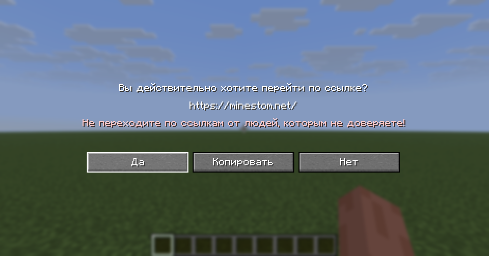

# Функциональность диалогов
В этой части будет рассмотрено как наделить функциональностью диалогвое окно. А именно что должно происходить после
нажатия кнопок типа `DialogActionButton`. Важно понимать, что диалоги наследуются от `datapacks`, поэтому многое 
завязано на текстовых идентификаторах и `акте доверия`, что тот или иной компонент будет присутствовть в теге, что может 
вызвать множество исключений.

---
<details>
<summary>Оглавление</summary>

- [Вступление](../README.md#вступление)
- [Структура диалогов](STRUCTURE.md#структура-диалогов)
- [Компоненты диалогов](COMPONENTS.md)
- [Функциональность диалогов](FUNCTIONALITY.md)
</details>

- [DialogAction](FUNCTIONALITY.md#dialogaction)
  - [OpenUrl](FUNCTIONALITY.md#openurl)
  - [ShowDialog](FUNCTIONALITY.md#showdialog)
  - [DynamicCustom](FUNCTIONALITY.md#dynamiccustom)
## DialogAction

`DialogAction` запечатанный (sealed) интерфейс описывающий действие после нажатия кнопок типа `DialogActionButton` и
передающийся в его конструктор как параметр. Имеет следующие конкретные реализации:

- DialogAction.OpenUrl
- DialogAction.RunCommand 
- DialogAction.SuggestCommand
- DialogAction.ShowDialog
- DialogAction.ChangePage
- DialogAction.CopyToClipboard
- DialogAction.Custom
- DialogAction.DynamicRunCommand
- DialogAction.DynamicCustom

Здесь будут рассмотрены только самые интересные: `DialogAction.OpenUrl`, 
`DialogAction.ShowDialog`, `DialogAction.DynamicCustom`. Самые любопытные путь идут на 
[четые буквы](https://javadoc.minestom.net/net.minestom.server/net/minestom/server/dialog/DialogAction.html).

### OpenUrl

Самое *сложное* действие из списка. Открывает ссылку. Имеет следующий конструктор:
```java
OpenUrl(String url)
```
- `url` адрес на который будет перенаправлен игрок.

После нажатия игроку отобразится уведомлением безопасности с адресом ссылки и предостережением что сервер является
сторонним и не связан с разработчиками игры.

Готовый пример, используя диалог типа `Notice`:
```java
var noticeDialog = new Dialog.Notice(
        new DialogMetadata(
                Component.text("Notice Dialog Type"),
                null,
                false,
                false,
                DialogAfterAction.CLOSE,
                List.of(),
                List.of()
        ),
        new DialogActionButton(Component.text("Открыть ссылочку."), null, 100,
                new DialogAction.OpenUrl("https://minestom.net/") //факт: автор очень хотел тут пошутить, но сдержался
        )
);
```

Как это выглядит после нажатия:



### ShowDialog

Открывает другой диалог после нажатия кнопки. Имеет следующий конструктор:
```java
ShowDialog(Holder<Dialog> dialog)
```
- `dialog` диалог который будет открыт. Не стоит пугаться *страшного* типа параметра. Достаточно передать объект типа
`Dialog`


  Готовый пример, используются диалоги типа `MultiAction` и `Notice`:
```java
Dialog multiAction = new Dialog.MultiAction(...);
        
var noticeDialog = new Dialog.Notice(
        new DialogMetadata(
                Component.text("Notice Dialog Type"),
                null,
                false,
                false,
                DialogAfterAction.CLOSE,
                List.of(),
                List.of()
        ),
        new DialogActionButton(Component.text("Открыть диалог."), null, 100,
                new DialogAction.ShowDialog(multiAction))
);
```

На этот раз читатель обойдётся без картинки.

### DynamicCustom

Позволяет обрабатывать данные введённые игроков в [виджеты ввода](COMPONENTS.md#dialoginput). Танцы с бубнами на 
костылях. `DynamicCustom` имеет следующий конструктор:
```java
DynamicCustom(Key key, @Nullable CompoundBinaryTag additions)
```

- `key` ключ по которому можно будет найти действие в `PlayerCustomClickEvent`
- `additions` дополнительные данные. Можно использовать заглушку `CompoundBinaryTag.builder().build()`

Обработать действие можно через ивент `PlayerCustomClickEvent`. Пример кода:
```java
new DialogAction.DynamicCustom(Key.key("omega"), CompoundBinaryTag.builder().build());
```

Обработать это действие:
```java
globalEventHandler.addListener(PlayerCustomClickEvent.class, (event) -> {
    if(event.getKey().equals(Key.key("omega"))) {
        System.out.println(event.getPayload().toString()); //Напечатать все данные о действии. Данные ввода и additions
    }
});
```

Метод `event.getPayload()` возвращает BinaryTag примерно с такой структурой:

```json
{
  "inputWidget_1key": [data1],
  "inputWidget_2key": [data2],
  //...
  "inputWidget_Nkey": [dataN],

  //addition:
  "addition_1key": [addidionValue1],
  "addition_2key": [addidionValue2],
  //...
  "addition_Nkey": [addidionValueN],
}
```

Рассмотрим полный пример:
```java
var noticeDialog = new Dialog.Notice(
        new DialogMetadata(
                Component.text("Notice Dialog Tipe"),
                null,
                false,
                false,
                DialogAfterAction.CLOSE,
                List.of(),
                List.of(
                        new DialogInput.Boolean("alpha", Component.text("label"), true, "aboba", "biboba"),
                        new DialogInput.NumberRange("beta", 200, Component.text("label"), "options.generic_value", 1, 10, 3f, 0.5f),
                        new DialogInput.Text("delta", 200, Component.text("label"), true, "first string", 100, null)
                        //ключи виджетов: "alpha", "beta", "delta"
                )
        ),
        new DialogActionButton(
                Component.text("Submit Scores"),
                Component.text("§7Click to submit your scoring."),
                100,
                new DialogAction.DynamicCustom(Key.key("omega"),
                        CompoundBinaryTag.builder()
                                .put("rho", IntBinaryTag.intBinaryTag(10))
                                .put("sigma", IntBinaryTag.intBinaryTag(11))
                                .put("thau", IntBinaryTag.intBinaryTag(12))
                                .build())
                //ключи additions: "rho", "sigma", "thau"
        )
);
```

Добавим обработчик действия и получим все данные:
```java
globalEventHandler.addListener(PlayerCustomClickEvent.class, (event) -> {
    if(event.getKey().equals(Key.key("omega"))) { //DynamicCustom.key
        boolean boolValue = ((CompoundBinaryTag) event.getPayload()).getBoolean("alpha");
        int intValue = ((CompoundBinaryTag) event.getPayload()).getInt("beta");
        String stringValue = ((CompoundBinaryTag) event.getPayload()).getString("delta");

        int addition1 = ((CompoundBinaryTag) event.getPayload()).getInt("rho");
        int addition2 = ((CompoundBinaryTag) event.getPayload()).getInt("sigma");
        int addition3 = ((CompoundBinaryTag) event.getPayload()).getInt("thau");
    }
});
```

`BinaryTag`, который генерирует `DialogAction.DynamicCustom`:
```json
BinaryTagType[CompoundBinaryTag 10]{tags={
  "sigma"=BinaryTagType[IntBinaryTag 3 (numeric)]{value=11}, 
  "alpha"=BinaryTagType[ByteBinaryTag 1 (numeric)]{value=1}, 
  "rho"=BinaryTagType[IntBinaryTag 3 (numeric)]{value=10}, 
  "delta"=BinaryTagType[StringBinaryTag 8]{value="first string"}, 
  "thau"=BinaryTagType[IntBinaryTag 3 (numeric)]{value=12}, 
  "beta"=BinaryTagType[FloatBinaryTag 5 (numeric)]{value=3.0f}}
}
```

- boolean boolValue =true
- int intValue =3
- String stringValue ="first string"
- int addition1 =10
- int addition2 =11
- int addition3 =12

На этом всё. Спасибо за внимание!

`Назад`: [Компоненты диалогов](COMPONENTS.md)