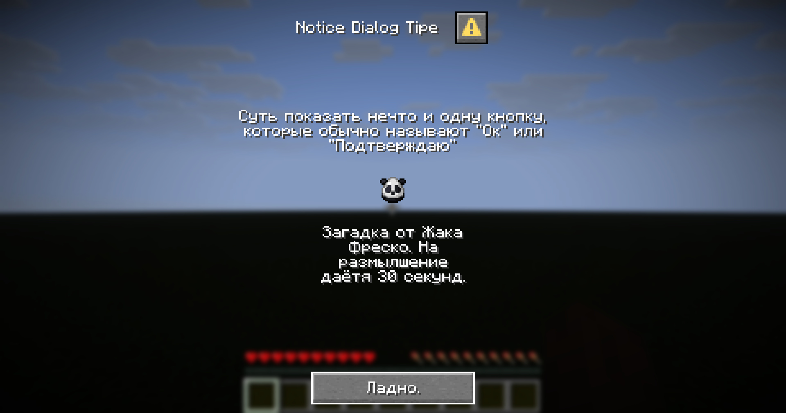
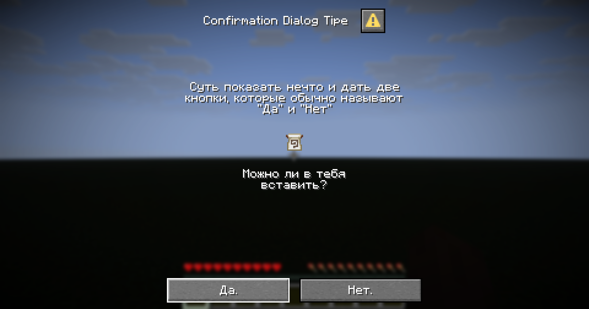
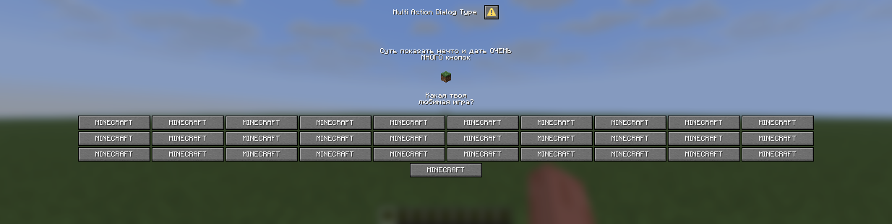
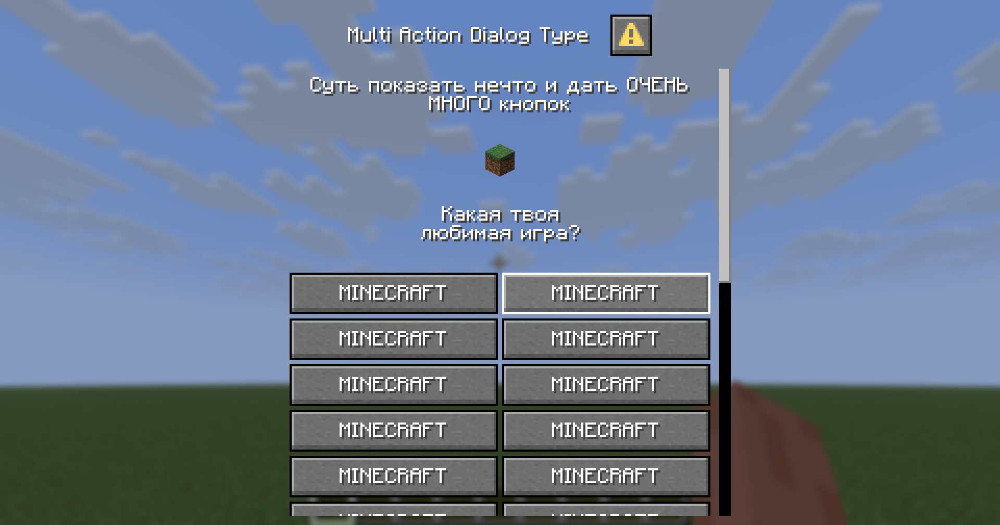
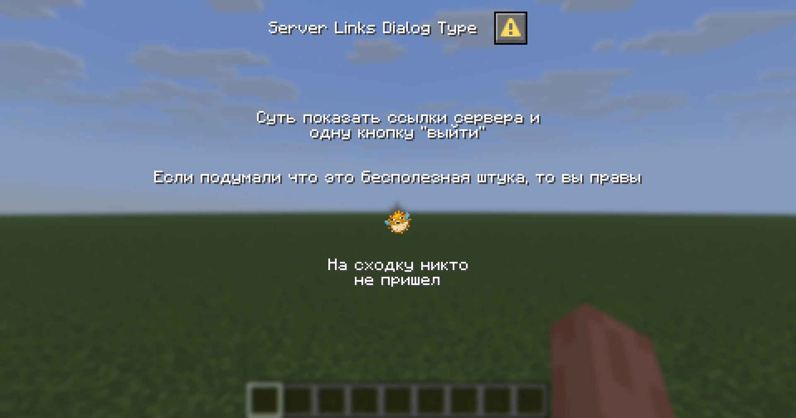
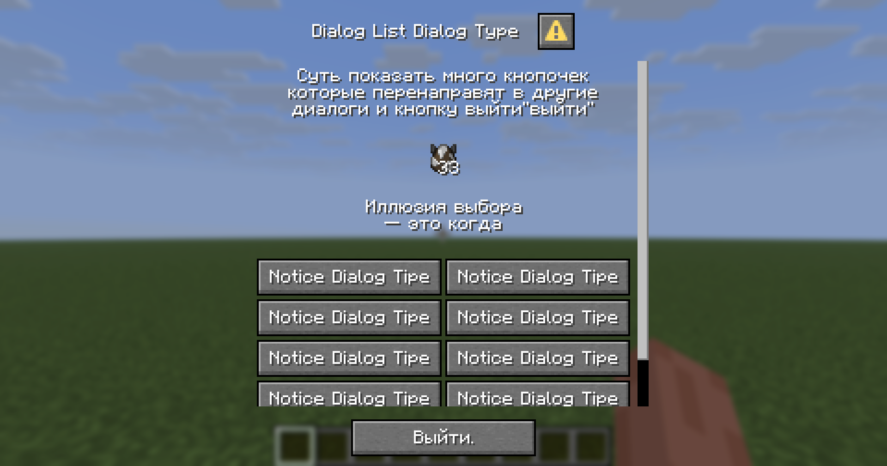

## Структура диалогов

---
<details>
<summary>Оглавление</summary>

- [Вступление](../README.md#вступление)
- [Структура диалогов](STRUCTURE.md#структура-диалогов)
</details>

- [Типы диалогов](STRUCTURE.md#типы-диалогов)
- [DialogMetadata](STRUCTURE.md#dialogmetadata)
- [Notice](STRUCTURE.md#notice)
- [Confirmation](STRUCTURE.md#confirmation)
- [Multi Action](STRUCTURE.md#multi-action)
- [Server Links](STRUCTURE.md#server-links)
- [Dialog List](STRUCTURE.md#dialog-list)

## DialogMetadata

Рассмотрим общую структуру диалогов, которую использует ванильный Minecraft. Полезно для понимания реализации от Minestom.
```js
// Подставлены значения по умолчанию, где они имеются
{
  "type": "...", // тип диалогового окна
  "title": "...", // заголовок окна
  "external_title": "...", // имя, по которому можно найти диалог извне; по умолчанию берётся значение title
  "body": [...], // содержимое диалога: либо текстовое сообщение, либо предметы из игры
  "inputs": [...], // элементы ввода: крутилки, кнопочки, поля для ввода и т.д.
  "can_close_with_escape": true, // можно ли закрыть окно клавишей Escape
  "pause": true, // ставится ли игра на паузу при открытии диалога (имеет смысл только в одиночной игре)
  "after_action": "close", // действие после нажатия кнопки или любого ввода от игрока
  
  "прочее зависит от type": "..."
}
```
Это основная часть любого диалога в Minecraft. Дополнительные поля зависят от типа диалога, указанного в `type`. 
В Minestom общие поля для различных типов диалогов упаковываются в `DialogMetadata`, чей конструктор имеет следующую 
сигнатуру:
```java
DialogMetadata(
        Component title, 
        @Nullable Component externalTitle,
        boolean canCloseWithEscape, 
        boolean pause, 
        DialogAfterAction afterAction, 
        List<DialogBody> body, 
        List<DialogInput> inputs)
```
Перегрузок у конструктора нет, поэтому нужно указывать все поля, даже если для них предусмотрены значения по умолчанию.

- `title` создаётся с помощью метода `Component.text(String text)`
- `canCloseWithEscape` и `pause` — обычные значения типа boolean
- `afterAction` принимает одно из значений enum `DialogAfterAction`: `CLOSE`, `NONE`, `WAIT_FOR_RESPONSE`
- `body` список объектов типа `DialogBody`. Подробнее о нём написано [тут](COMPONENTS.md#dialogbody). При необходимости 
можно передать пустой список с помощью `List.of()`
- `inputs` список объектов типа `DialogInput`. Подробнее о нём также написано [тут](COMPONENTS.md#dialoginput). При необходимости 
можно передать пустой список с помощью `List.of()`

Вот рабочий пример создания объекта типа DialogMetadata:
```java
new DialogMetadata(
        Component.text("Title"),
        null, false, false,
        DialogAfterAction.CLOSE,
        List.of(
                new DialogBody.PlainMessage(Component.text("Текст"), 200),
                new DialogBody.Item(ItemStack.of(Material.PANDA_SPAWN_EGG), null, false, false, 16, 16),
                new DialogBody.PlainMessage(Component.text("Ещё текст"), 100)
        ),
        List.of(
                new DialogInput.Text("id", 400, Component.text("label"), true, "Текст по умолчанию", 100, new DialogInput.Text.Multiline(10, 50))
        )
)
```
## Типы диалогов

Тип диалога определяет его конечную структуру. Поля JSON для каждого типа диалога можно изучить в [Wiki](https://minecraft.wiki/w/Dialog). Здесь же будут 
сразу рассматриваться конструкторы интересующих нас объектов, так как они верно повторяют структуру JSON.

Все данные типы диалогов из Minestom являются наследниками запечатанного (sealed) интерфейса `Dialog`. Это означает, что 
Minestom не предусматривает создание новых типов диалогов. Однако существующие типы и поля `body` и `inputs` в конструкторе 
`DialogMetadata` предоставляют достаточно возможностей для кастомизации.
## Notice

`Уведомление` — это диалоговое окно с одной кнопкой действия в нижней части. Реализовывается вложенным классом 
`Dialog.Notice`, чей конструктор имеет следующую сигнатуру:
```java
Notice(DialogMetadata metadata, DialogActionButton action)
```
- `metadata` содержит общие поля для всех типов диалогов. Подробнее — [тут](STRUCTURE.md#dialogmetadata)
- `action` описывают кнопку в нижней части окна. Подробнее — [тут](COMPONENTS.md#dialogactionbutton)

Пример готового `Notice` диалога:
```java
var noticeDialog = new Dialog.Notice(
        new DialogMetadata(
                Component.text("Notice Dialog Type"),
                null,
                false,
                false,
                DialogAfterAction.CLOSE,
                List.of(
                        new DialogBody.PlainMessage(Component.text("Суть — показать нечто и одну кнопку, которую обычно называют \"Ок\" или \"Подтверждаю\""), 200),
                        new DialogBody.Item(
                                ItemStack.of(Material.PANDA_SPAWN_EGG),
                                null, false, false, 16, 16),
                        new DialogBody.PlainMessage(Component.text("Загадка от Жака Фреско. На размылшение даётя 30 секунд."), 100)
                ),
                List.of()
        ),
        new DialogActionButton(Component.text("Ладно."), null, 100, null)
);
```
Как это выглядит:


## Confirmation

`Подтверждение` — это диалоговое окно с двумя кнопками действия в нижней части. Реализовывается вложенным классом
`Dialog.Confirmation`, чей конструктор имеет следующую сигнатуру:
```java
Confirmation(DialogMetadata metadata, DialogActionButton yesButton, DialogActionButton noButton)
```
- `metadata` содержит общие поля для всех типов диалогов. Подробнее — [тут](STRUCTURE.md#dialogmetadata)
- `yesButton` описывают первую кнопку в нижней части окна
- `noButton` описывают вторую кнопку в нижней части окна. Подробнее про `DialogActionButton` — [тут](COMPONENTS.md#dialogactionbutton)

Пример готового `Confirmation` диалога:
```java
var confirmationDialog = new Dialog.Confirmation(
        new DialogMetadata(
                Component.text("Confirmation Dialog Type"),
                null,
                false,
                false,
                DialogAfterAction.CLOSE,
                List.of(
                        new DialogBody.PlainMessage(Component.text("Суть показать нечто и дать две кнопки, которые обычно называют \"Да\" и \"Нет\""), 200),
                        new DialogBody.Item(
                                ItemStack.of(Material.FLOW_BANNER_PATTERN),
                                null, false, false, 16, 16),
                        new DialogBody.PlainMessage(Component.text("Можно ли в тебя вставить?"), 100)
                ),
                List.of()
        ),
        new DialogActionButton(Component.text("Да."), null, 100, null),
        new DialogActionButton(Component.text("Нет."), null, 100, null)
);
```
Как это выглядит:


## Multi Action

`Много-действие` — это прокручиваемое (вертикально) диалоговое окно с n-ым колличеством кнопок `действия` в нижней части. 
Где n >= 1. Реализовывается вложенным классом `Dialog.MultiAction`, чей конструктор имеет следующую сигнатуру:
```java
MultiAction(DialogMetadata metadata, List<DialogActionButton> actions, @Nullable DialogActionButton exitAction, int columns)
```
- `metadata` содержит общие поля для всех типов диалогов. Подробнее — [тут](STRUCTURE.md#dialogmetadata)
- `actions` НЕ ПУСТОЙ список кнопок в нижней части окна. Если оставить пустым игрок будет выкинут при отправке диалога.
Содержит объекты типа `DialogActionButton`
- `exitAction` опциональная кнопка отображаемая в самом низу. Подробнее про `DialogActionButton` — [тут](COMPONENTS.md#dialogactionbutton)
- `сolumns` число больше или равно 1. Описывает колличество колонн на которые будет разбит список кнопок из `actions`.
Рекомендуется не выставлять слишком крупное значение, потому что прокрутка по горизонтали невозможна. Единственный 
способ просмотреть все кнопки в таком случае — растянуть как-то окно игры. 

Пример плохого использования `MultiAction` (columns=10)



Пример готового `MultiAction` диалога:
```java
var multiAction = new Dialog.MultiAction(
        new DialogMetadata(
                Component.text("Multi Action Dialog Type"),
                null,
                true,
                false,
                DialogAfterAction.CLOSE,
                List.of(
                        new DialogBody.PlainMessage(Component.text("Суть показать нечто и дать ОЧЕНЬ МНОГО кнопок"), 200),
                        new DialogBody.Item(
                                ItemStack.of(Material.GRASS_BLOCK),
                                null, false, false, 16, 16),
                        new DialogBody.PlainMessage(Component.text("Какая твоя любимая игра?"), 100)
                ),
                List.of()
            ),
        List.of(
                new DialogActionButton(Component.text("MINECRAFT"), null, 100, null),
                new DialogActionButton(Component.text("MINECRAFT"), null, 100, null),
                //...
                new DialogActionButton(Component.text("MINECRAFT"), null, 100, null)
        ),
        null, //обошлись без exit button
        2
);
```

Как это выглядит:


## Server Links

`Ссылки сервера` — это прокручиваемое (вертикально) диалоговое окно с одной опциональной кнопкой выхода в нижней части 
окна и с n-ым колличеством кнопок `которые отсылают на ссылки сервера`. В теории отображает ссылки которые 
перечисляются где-то в настройках сервера. Неизвестно работает ли это тут. Читателю как разработчику этот тип диалога 
показаться бесполезным. 

Реализовывается вложенным классом `Dialog.ServerLinks` чей конструктор имеет следующую сигнатуру:
```java
ServerLinks(DialogMetadata metadata, @Nullable DialogActionButton exitAction, int columns, int buttonWidth)
```
- `metadata` содержит общие поля для всех типов диалогов. Подробнее — [тут](STRUCTURE.md#dialogmetadata)
- `exitAction` опциональная кнопка отображаемая в самом низу. Подробнее — про `DialogActionButton` [тут](COMPONENTS.md#dialogactionbutton)
- `columns` описывает колличество колонн на которые будет разбит список *ссылок сервера*.
- `buttonWidth` описывает ширину кнопки которая будет переадрессовывать на *ссылку сервера*

Пример готового `ServerLinks` диалога:
```java
var serverLinks = new Dialog.ServerLinks(
        new DialogMetadata(
                Component.text("Server Links Dialog Type"),
                null,
                true,
                false,
                DialogAfterAction.CLOSE,
                List.of(
                        new DialogBody.PlainMessage(Component.text("Суть показать ссылки сервера и одну кнопку \"выйти\""), 200),
                        new DialogBody.PlainMessage(Component.text("Если подумали, что это — бесполезная штука, то вы правы"), 400),
                        new DialogBody.Item(
                                ItemStack.of(Material.PUFFERFISH),
                                null, false, false, 16, 16),
                        new DialogBody.PlainMessage(Component.text("На сходку никто не пришел"), 100)
                ),
                List.of()
        ),
        null,
        1,
        100
);
```

Как это выглядит:


## Dialog List

`Список диалогов` — это прокручиваемое (вертикально) диалоговое окно с одной опциональной кнопкой выхода в нижней части
окна и с n-ым колличеством кнопок `которые отсылают на другие диалоги`. Где n >= 0. Реализовывается вложенным классом 
`Dialog.DialogList` чей конструктор имеет следующую сигнатуру:
```java
DialogList(DialogMetadata metadata, HolderSet<Dialog> dialogs, @Nullable DialogActionButton exitAction, int columns, int buttonWidth)
```
- `metadata` содержит общие поля для всех типов диалогов. Подробнее — [тут](STRUCTURE.md#dialogmetadata)
- `dialogs` контейнер для диалогов. Можно создать при помощи конструктора `new HolderSet.Direct<>(List<? extends Dialog> list)`
- `exitAction` опциональная кнопка отображаемая в самом низу. Подробнее про `DialogActionButton` — [тут](COMPONENTS.md#dialogactionbutton)
- `сolumns` число больше или равно 1. Описывает колличество колонн на которые будет разбит список кнопок ссылающихся 
на диалоги из `dialogs`. Рекомендуется не выставлять слишком крупное значение, потому что прокрутка по горизонтали 
невозможна. Единственный способ просмотреть все кнопки в таком случае растянуть как-то окно игры.

Пример плохого использования `MultiAction` (columns=10)


Пример готового `DialogList` диалога:

Во-первых, создадим какой-нибудь диалог на который будут ссылаться кнопки `DialogList`. Пусть будет `Notice Dialog`
создание которого было рассмотрено [тут](STRUCTURE.md#notice)
```java
                var noticeDialog = new Dialog.Notice( ... );
```
А вот сам пример:
```java
                var dialogList = new Dialog.DialogList(
                        new DialogMetadata(
                                Component.text("Dialog List Dialog Type"),
                                null,
                                true,
                                false,
                                DialogAfterAction.CLOSE,
                                List.of(
                                        new DialogBody.PlainMessage(Component.text("Суть показать много кнопочек которые перенаправят в другие диалоги и кнопку выйти\"выйти\""), 200),
                                        new DialogBody.Item(
                                                ItemStack.of(Material.COW_SPAWN_EGG, 33),
                                                null, false, false, 16, 16),
                                        new DialogBody.PlainMessage(Component.text("Иллюзия выбора — это когда"), 100)
                                ),
                                List.of()
                        ),
                        new HolderSet.Direct<>(
                                List.of(
                                        noticeDialog,
                                        noticeDialog,
                                        noticeDialog,
                                        noticeDialog,
                                        noticeDialog,
                                        noticeDialog,
                                        noticeDialog,
                                        noticeDialog,
                                        noticeDialog,
                                        noticeDialog
                                )
                        ),
                        new DialogActionButton(Component.text("Выйти."), null, 100, null),
                        2,
                        100
                );
```
Как это выглядит:
